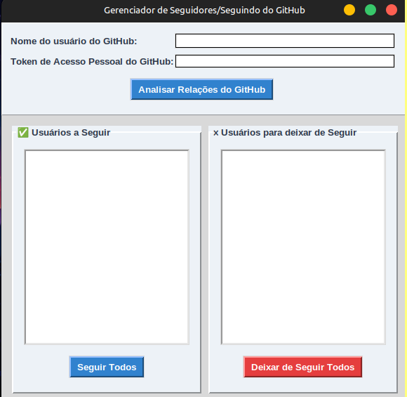

# Python Project Portfolio

Hello! This repository serves as my central portfolio, dedicated to showcasing my Python skills through a variety of hands-on projects. Here you'll find everything from web applications and automation scripts to data analysis studies. Please browse the menu below to explore each project individually.

<p align="center">
  
  
  
  
  
  
</p>

## 📋 Projects Menu
Here’s the list of projects in this portfolio.  
Click a project name to jump to its section.
- [x] [File Organization](#-file-organization)
- [x] [Github Manager](#-gitHub-manager)
- [ ] [Employee Management](#-employee-management)

-------------------------------------------------------------------------------------------------------------------------------------------------------------------------

## 🚀 File Organization 
<p>
  
</p>

### *Description*
This project is a Python automation script that organizes files in a specified folder (default: Downloads) into subfolders based on their extensions.
It automatically creates the necessary folders, handles duplicate filenames by adding a counter, and logs all actions in a .txt file..

### *Technologies Used*
<p>
 

 

</p>

### *Project Structure*
```📂 project_root
 ├── organizer.py        # Main script
 ├── organizer_log.txt   # Log file generated automatically
 ├── test/
 │   └── test.py         # Unit tests
 ├── README.md           # Project documentation
```

### *Features*
- Organizes files by extension into separate folders.
- Creates missing folders automatically.
- Avoids overwriting files with the same name by renaming them.
- Generates a detailed log of all actions.
- Includes automated unit tests.

### *How to Run*

```bash
# Default: organizes the Downloads folder
python organizer.py

# Or specify a folder
python organizer.py "C:\Users\yourname\Documents\MyFiles"
```
#### ⏰ **Automate Daily Execution on Windows**
You can schedule the file_organizer.py script to run automatically once a day using the Windows Task Scheduler. This keeps your folders organized without manual effort.

#### 🧭 **Step-by-Step Instructions**
1. **Open Task Scheduler** 
    - Press Win + R, type taskschd.msc, and press Enter.
2. **Create a New Task**
    - In the right-hand panel, click on "Create Task".
3. **General Tab** 
    - Name: File Organizer
    - Check: "Run with highest privileges"
    - Choose: "Run only when user is logged on"
4. **Triggers Tab**
    - Click "New..."
    - Begin the task: On a schedule
    - Settings: the schedule frequency that suits you (e.g., Daily, Weekly, Monthly, or Hourly)
    - Start: Choose your preferred time (e.g., 08:00 AM)
5. **Actions Tab**
    - Click "New..."
    - Action: Start a program
    - Program/script:
  ```bash
  python
  ```
  - **Add arguments (replace with your actual script path):**  :
  ```bash
  "C:\Users\YourUsername\Documents\Python\organizer\organizer.py"
  ```
6. **Conditions Tab (Optional)**
   - Uncheck "Start the task only if the computer is on AC power" if you're on a laptop.
7. **Save and Run**
  - Click OK to save.
  - To test it, right-click your task and select "Run".

✅ Done! Your folder will be organized automatically every day.

### *Example*
Before
``` 
Downloads/
 ├── report.pdf
 ├── image.png
 ├── script.py
```

After
```
Downloads/
 ├── PDF/
 │   └── report.pdf
 ├── PNG/
 │   └── image.png
 ├── PY/
 │   └── script.py
```

<br>

↩️ [Menu](#-projects-menu)

--------------------------------------------------------------------------------------------------------------------------------------------------------------------------

## 🚀 GitHub Manager
<P>
   
  
</P>

### *Description*
This project is a Python desktop application built with Tkinter that allows users to manage their GitHub relationships (followers and following) through the GitHub REST API.
It lets you:
- View which followers you are not following back.
- View which users you follow that do not follow you back.
- Follow or unfollow users in bulk with a single click.
- Track the process with a live status bar.

### *Technologies Used*
<p>
   
   
   
  
</p>

### *Project Structure*
```
📂 project_root
 ├── api_connection.py   # Functions to interact with GitHub API (followers/following/follow/unfollow)
 ├── github_manager.py   # Tkinter UI and application logic
 ├── app.py              # Application entry point
 ├── README.md           # Project documentation
```
   
### *Features*
- Connects to the GitHub API with a Personal Access Token.
- Retrieves complete followers and following lists with pagination.
- Compares relationships to identify:
- Users you can follow back.
- Users you may want to unfollow.
- Execute follow/unfollow actions in bulk.
- Clean and responsive Tkinter GUI.
- Status updates for each action.

### *How to Use*

1. Clone este repositório
   ```
   git clone https://github.com/AdrianoR85/Python-Automation-Projects.git
   cd Python-Automation-Projects/github_manager
   ```
2. Instale as dependências
Certifique-se de ter o Python 3.8+ instalado. Depois, execute:
   ```
   pip install -r requirements.txt
   ```
3. Execute o projeto
Dependendo do projeto, pode variar:
   ```
     python app.py
   ```
### *Image*
<p align="center">
  
</p>

<br>

↩️ [Menu](#-projects-menu)

--------------------------------------------------------------------------------------------------------------------------------------------------------------------------

## 🚀 Employee Management
<p>
   
</p>

### *Description*

### *Technologies Used*
<p>
  
</p>

### *Project Structure*

### *Features*

<br>

↩️ [Menu](#-projects-menu)

--------------------------------------------------------------------------------------------------------------------------------------------------------------------------
## 📬 Contact

Feel free to reach out if you have ideas or questions — or just want to geek out about Python!

